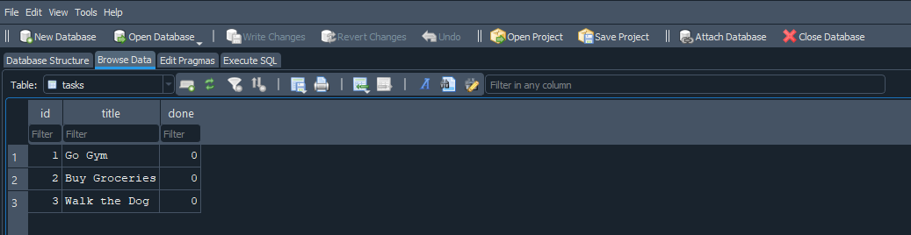
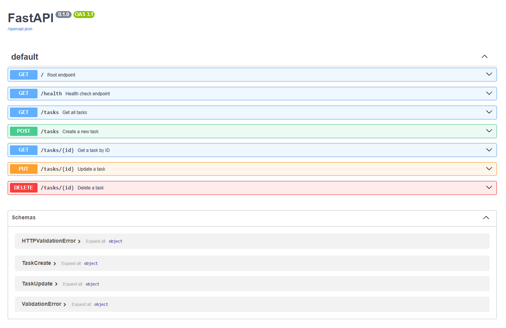
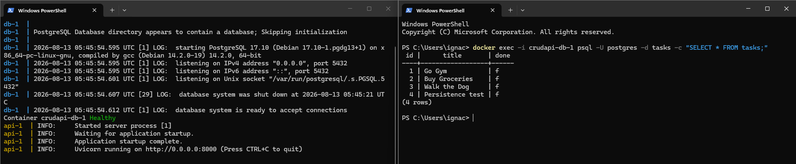

# Task API

**CRUD API for managing tasks, backed by a Postgres in Docker database.** This was made as a part of an assignment for FlyRank's professional internship.

*The list of tasks comes with three initial tasks*

*The endpoint table, request shapes, and status codes are unchanged from the in-memory version; only the storage layer was replaced.*

## Requirements

Docker

## Installation & running

```bash
git clone https://github.com/IgnacioSin/CRUD-API.git

cd CRUD-API

cp .env.example .env

docker compose up
```

## Storage

**Why SQLite?**

Because it's a single file with no server to install or configure, it survives restarts, and it's created automatically on first run.
Also, for better or worse, the tradeoff is concurrency: SQLite permits a single writer at a time, so another process holding the file open can block writes.

**Where does the data live?**

All the data lives in `tasks.db`, created automatically, git-ignored so each clone starts fresh.



## Endpoints

| Endpoint | Description | Success | Errors |
|--------|-------------|---------|--------|
|`GET /`|Returns basic information about the API|`200`||
|`GET /health`|Returns the health status of the API|`200`||
|`GET /tasks`|Returns a list of all tasks|`200`||
|`POST /tasks`|Creates a new task with the provided title|`201`|`400`|
|`GET /tasks/{id}`|Returns a single task by its ID|`200`|`404`|
|`PUT /tasks/{id}`|Updates a task with the provided ID|`200`|`400` or `404`|
|`DELETE /tasks/{id}`|Deletes a task with the provided ID|`204`|`404`|

## Interactive documentation

Interactive docs at `http://localhost:8000/docs`



## Known limitations

Validation errors raised by FastAPI itself (for example, a non-integer ID)
return a `422` with a `detail` field, while the API's own errors return `400`
or `404` with an `error` field.

## SQL

The database can be inspected and modified directly with DB Browser for SQLite,
independently of the API.

```sql
UPDATE tasks SET done = 1;
```

This marked every task as completed — with no `WHERE` clause, the update applies
to every row in the table. Running `GET /tasks` immediately afterwards reflected
the change without restarting the server, because the API and DB Browser read
the same `tasks.db` file.

## AI vs me

After building this API by hand (Assignment 1), I asked an AI assistant to build
the same thing from a prompt written from memory, then compared the results.

### My prompt

> I need a ai_main.py file of a CRUD API for maganing tasks. It should use fast
> api and have just in-memory data. I want it to do the functions of GET, POST,
> PUT and DELETE.

The AI's version is in [`ai-version/`](ai-version/).

### What the AI did better

**Used a dictionary keyed by ID instead of a list.** 

My version loops over every task to find one. A dict looks it up directly.

**Handled partial updates with `model_dump(exclude_unset=True)` and `model_copy(update=...)`.** 

This returns only the fields the client actually sent, so omitted fields are left untouched automatically.

### What it got wrong or ignored

| Behavior | My version | AI version |
|---|---|---|
| Fresh `GET /tasks` | 3 seed tasks | `[]` |
| `POST {}` | `400` + `{"error": ...}` | `422` + `{"detail": [...]}` |
| Task schema | `id`, `title`, `done` | `id`, `title`, `description`, `completed` |
| `GET /` | `200` | `404` — not implemented |
| `GET /health` | `200` | `404` — not implemented |
| `GET /tasks/99` | `404` + `{"error": ...}` | `404` + `{"detail": ...}` |

### What my prompt forgot to specify

I named the four methods but no status codes, no schema, no seed data, only five of my seven endpoints, no error body shape, no validation rule. 
The point is that every difference in the table above traces to a gap in the prompt, not to the AI being wrong. 
It got 201, 204 and 404 right without being told, because those are strong conventions, everything unconventional it invented, reasonably.

## Database (A3)

Postgres runs in a Docker container, no local install needed.

Command to create the container: 

```bash
docker run --name taskdb -e POSTGRES_PASSWORD=dev -e POSTGRES_DB=tasks -p 5432:5432 -v taskdata:/var/lib/postgresql/data -d postgres:17
```

If you put only the name as a parameter ('postgres' in this case) it finds the latest version. It does `'name':latest`.

Used postgres:17 rather than postgres latest version because of the data directory layout. :17 version stores its data in `/var/lib/postgresql/data` that matches with the path in the command above, while the latest version may not.

### Curl Walk

```bash
# List all tasks
curl -i http://localhost:8000/tasks

# Get one task
curl -i http://localhost:8000/tasks/1

# Unknown id → 404
curl -i http://localhost:8000/tasks/999

# Create → 201
curl -i -X POST http://localhost:8000/tasks \
  -H "Content-Type: application/json" \
  -d '{"title":"Test task"}'

# Missing title → 400
curl -i -X POST http://localhost:8000/tasks \
  -H "Content-Type: application/json" \
  -d '{"title":""}'

# Partial update → 200, title preserved
curl -i -X PUT http://localhost:8000/tasks/1 \
  -H "Content-Type: application/json" \
  -d '{"done":true}'

# Delete → 204
curl -i -X DELETE http://localhost:8000/tasks/4

# Delete unknown id → 404
curl -i -X DELETE http://localhost:8000/tasks/999
```

## Curl Example

```http
HTTP/1.1 200 OK
date: Thu, 13 Aug 2026 05:42:06 GMT
server: uvicorn
content-length: 180
content-type: application/json

[{"id":1,"title":"Go Gym","done":false},{"id":2,"title":"Buy Groceries","done":false},{"id":3,"title":"Walk the Dog","done":false},{"id":4,"title":"Persistence test","done":false}]
```

### Docker running image

